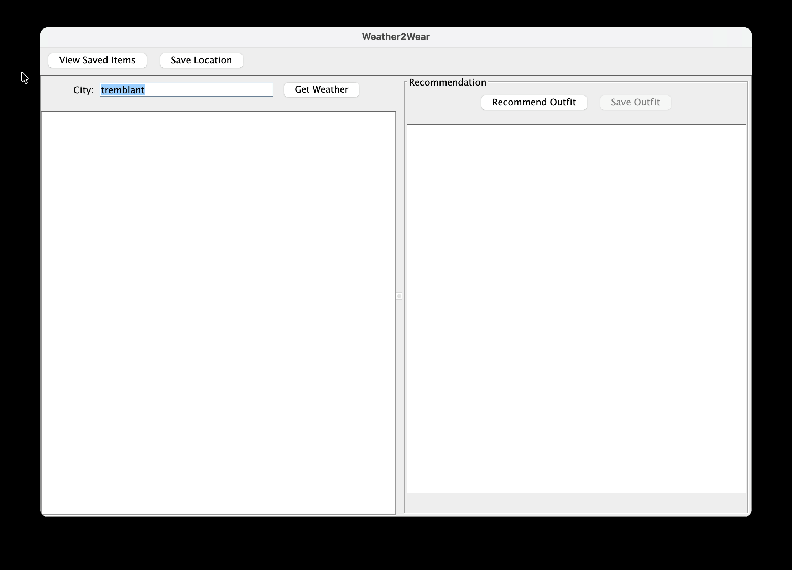

# Weather2Wear

A Weather & Wardrobe Recommendation Application  
*Team TUT0101-11 – CSC207 Team Project*

Please keep this up-to-date with information about your project throughout the term.

The readme should include information such as:
- a summary of what your application is all about
- a list of the user stories, along with who is responsible for each one
- information about the API(s) that your project uses 
- screenshots or animations demonstrating current functionality

By keeping this README up-to-date,
your team will find it easier to prepare for the final presentation
at the end of the term.

## 👥 Team Members & Responsibilities
Use Case Assignments:
- Parker – Get current weather data (User Story #1)
- Carl – Provide clothing recommendations (User Story #2)
- Elizabeth – Save favourite location (User Story #3)
- Ellen – View multi-day forecast (merged with UC1) (User Story #4)
- Chengcheng – Save and view outfit preferences (User Story #5)
- Mitchell – Manage saved outfits and locations (User Story #6)

---

## 📜 User Stories

### **UC1 – View Current Weather**
*As a user, I want to search for a city and see the current weather so I know what to expect.*

### **UC2 – Outfit Recommendation**
*As a user, I want the system to recommend an outfit based on temperature and conditions.*

### **UC3 – Favorite Locations**
*As a user, I want to save favourite locations so I can check them quickly.*

### **UC4 – Multi-Day Forecast**
*As a user, I want to see a multi-day forecast to decide future outfits.*

### **UC5 – Save & Manage Favorite Outfits**
*As a user, I want to save my favourite outfits (with weather profiles and location) and reuse them later.*

---

## 🔌 External API: Open-Meteo

**Weather2Wear** uses the **Open-Meteo API** to fetch:

- Current temperature
- Feels like temperature
- Humidity
- Wind speed
- Weather condition codes
- Multi-day forecast

## 🎬 Application Demo

### 🌤️ Search Weather & Get Outfit Recommendations (UC1 & UC2)

**Features demonstrated:**
- Entering a city name
- Fetching current weather data
- Displaying multi-day forecast
- Generating outfit recommendations based on:
    - temperature
    - precipitation
    - wind
    - seasonal/weather trends

---

### 💾 Saved Items Dashboard (UC3 & UC5)

**Features demonstrated:**
- Saving favourite locations
- Loading all saved items
- Saving recommended outfits
- Editing or deleting outfits
- Viewing outfits with associated weather profiles and locations
